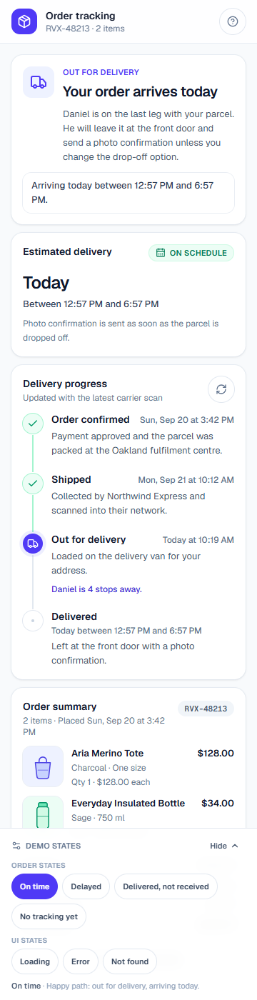
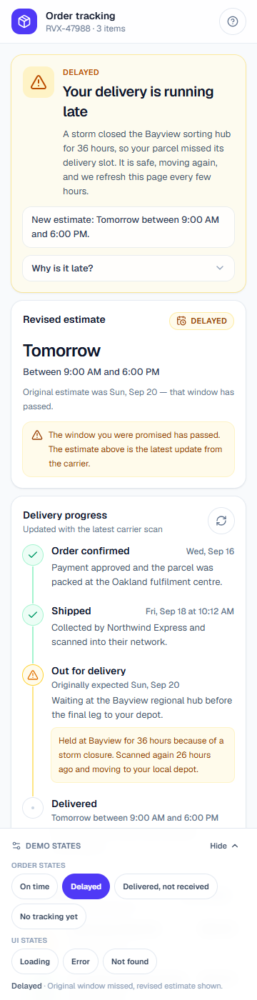
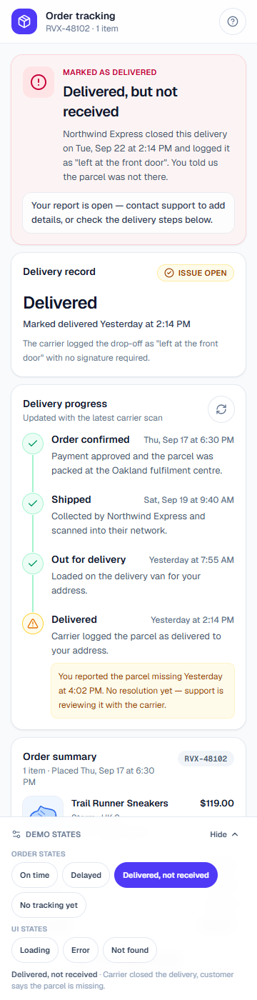
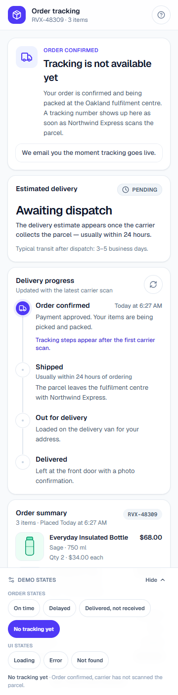

# Order Tracking — Rovex

A polished, mobile-first **order tracking screen** for an e-commerce application,
built with **Next.js**, **TypeScript**, and **Tailwind CSS**, and deployed on
**Vercel**.

The screen renders a single order experience that adapts to every status a
customer could encounter: an on-time delivery, a weather-delayed parcel, an order
the carrier marked "delivered" that the customer never received, and an order
whose tracking has not gone live yet. Each state is driven by reusable,
data-driven components and is reviewable through an in-page state switcher and
shareable `?scenario=` URL parameter.

> This is a **front-end only** demo. All data is generated locally with mock
> content; no backend or real carrier API is connected. See
> [Project limitations](#project-limitations) for details.

---

Table of contents

- [Screenshots](#screenshots)
- [Key features](#key-features)
- [Technology stack](#technology-stack)
- [Live demo](#live-demo)
- [Repository](#repository)
- [Local installation](#local-installation)
- [Development commands](#development-commands)
- [Build and testing](#build-and-testing)
- [Deployment to Vercel](#deployment-to-vercel)
- [Mock data and supported states](#mock-data-and-supported-states)
- [Project limitations and future improvements](#project-limitations-and-future-improvements)
- [Design and architecture notes](#design-and-architecture-notes)

---

## Screenshots

| On time (baseline)                                                                             | Delayed                                                                                        | Delivered, not received                                                                                                    |
| ---------------------------------------------------------------------------------------------- | ---------------------------------------------------------------------------------------------- | -------------------------------------------------------------------------------------------------------------------------- |
|  |  |  |

| Tracking unavailable                                                                                      | Loading             | Error            |
| --------------------------------------------------------------------------------------------------------- | ------------------- | ---------------- |
|  | _(skeleton loader)_ | _(retry prompt)_ |

> Run the local smoke test to capture your own screenshots:
> `npm run smoke` starts the production build on `http://127.0.0.1:4321`.

---

## Key features

- **Responsive mobile layout** — single-column card stack centered in a `max-w-[440px]`
  viewport, with `overflow-x: clip` to guarantee zero horizontal scroll at
  360 px / 390 px / 430 px widths.
- **Visual delivery timeline** — four stages (Processing → Shipped → Out for
  Delivery → Delivered) with completed, current, upcoming and **exception**
  states, each carrying screen-reader text and an `aria-current` marker.
- **Status banner** — prominent `h1` headline, supporting description, a single
  next-step sentence, and a "why is it late" disclosure for delayed orders.
- **Delivery estimate card** — on-track, revised, pending and delivered states
  with overdue detection and contextual helper text.
- **Order summary** — product image, name, variant, quantity and line total,
  followed by a payment breakdown (subtotal, promo, shipping, tax, total).
- **Scenario-aware support** — primary and secondary actions change per state
  (contact support, view details, report a delivery issue, toggle
  notifications).
- **Bottom sheets** — accessible modal drawers for order details, contact support
  (with mock chat / phone / email), and a validated delivery-issue report form.
- **Toast feedback** — non-blocking, polite live-region notifications for
  copy, refresh, notification toggle and report submission.
- **Loading, error and empty states** — skeleton, retry-error and not-found
  layouts that mirror the real page geometry.
- **Shareable state** — every order state is a URL: `?scenario=delayed`.
- **State switcher** — sticky bottom chip bar for demo review of all states.
- **Accessibility baked in** — focus rings, `:focus-visible`, keyboard traps in
  sheets, `aria-modal`, semantic landmarks and exactly one `h1` per page.

---

## Technology stack

| Layer       | Choice                                                     |
| ----------- | ---------------------------------------------------------- |
| Framework   | [Next.js 16](https://nextjs.org) (App Router, Turbopack)   |
| Language    | TypeScript 5 (`strict`, `noEmit`)                          |
| Styling     | [Tailwind CSS 4](https://tailwindcss.com) (JIT, `@import`) |
| Icons       | [lucide-react](https://lucide.dev)                         |
| Fonts       | `next/font/google` — **Geist** (sans) and **Geist Mono**   |
| Linting     | ESLint 9 (`eslint-config-next` + `core-web-vitals`)        |
| Formatting  | Prettier 3.9                                               |
| Images      | `next/image` (local SVGs, `unoptimized`)                   |
| Deploy      | Vercel (SSR route for `?scenario=`)                        |
| Test runner | Custom Node smoke script (`scripts/smoke-test.mjs`)        |

No UI framework libraries (e.g. Material, Chakra) are used — the interface is
built from a small set of local `components/ui` primitives and Tailwind
utility classes, keeping the dependency footprint tiny.

---

## Live demo

- **Vercel (production build):**
  https://order-tracking-screen-six.vercel.app
- **Local production:** `npm run build && npm start`, then open
  `http://127.0.0.1:3000`.

> The demo ships four sample orders plus three UI states. Use the **Demo states**
> chip bar at the bottom of the screen or append `?scenario=<key>` to the URL.

---

## Repository

- **GitHub:** https://github.com/Kaoserahamed/Assignment_Task1
- **Default branch:** `main`

---

## Local installation

### Prerequisites

- Node.js ≥ 18 (developed on Node 20)
- npm 10+ (or another package manager)

### Steps

```bash
git clone https://github.com/Kaoserahamed/Assignment_Task1.git
cd Assignment_Task1
npm install
npm run dev
# → http://localhost:3000
```

---

## Development commands

| Command                | Description                                                         |
| ---------------------- | ------------------------------------------------------------------- |
| `npm run dev`          | Start the Next.js dev server with hot reload.                       |
| `npm run build`        | Production build (`next build`).                                    |
| `npm start`            | Serve the production build locally.                                 |
| `npm run lint`         | Run ESLint across the project.                                      |
| `npm run lint:fix`     | ESLint with `--fix`.                                                |
| `npm run typecheck`    | Run `tsc --noEmit` (strict type check).                             |
| `npm run format`       | Format the source with Prettier.                                    |
| `npm run format:check` | Verify formatting without writing.                                  |
| `npm run smoke`        | Start the production server and run the HTTP smoke test against it. |

The app uses no runtime environment variables. A local `.env.local` is created
by the Vercel CLI during linking and is git-ignored — it contains only the
Vercel OIDC token and is never read by the application code.

---

## Build and testing

```bash
npm run typecheck   # ✅ passes
npm run lint        # ✅ passes
npm run build       # ✅ passes (Turbopack, static pages)
npm run smoke       # ✅ 9 page checks + 6 CSS checks + a11y assertions
```

The smoke test (`scripts/smoke-test.mjs`) spins up `next start` on port 4321,
requests every demo state, and asserts on rendered copy, CSS tokens and
accessibility invariants (single `h1`, `main` landmark, labelled controls).

To test a live deployment instead:

```bash
SMOKE_BASE_URL=https://order-tracking-screen-six.vercel.app npm run smoke
```

---

## Deployment to Vercel

1. The project is already linked to a Vercel project
   (`order-tracking-screen`). `.vercel/project.json` stores the project/org IDs.
2. From a clean checkout, connect to GitHub and import the repository in the
   Vercel dashboard, **or** run:

   ```bash
   npx vercel          # deploy preview
   npx vercel --prod   # promote to production
   ```

3. The app builds with zero configuration — `next.config.ts` is the Next.js
   default. The only dynamic route is `/?scenario=` (read via `searchParams`),
   kept server-rendered so each state is shareable and crawlable.

No environment variables need to be set in the Vercel dashboard.

---

## Mock data and supported states

All orders are generated in `data/mock-orders.ts` from a reference date, so
timelines and "today" labels stay correct whenever the page loads.

### Order scenarios (4)

| `scenario`               | Order #   | Headline                        | Tone            |
| ------------------------ | --------- | ------------------------------- | --------------- |
| `on_time`                | RVX-48213 | "Your order arrives today"      | info / blue     |
| `delayed`                | RVX-47988 | "Your delivery is running late" | warning / amber |
| `delivered_not_received` | RVX-48102 | "Delivered, but not received"   | critical / rose |
| `tracking_unavailable`   | RVX-48309 | "Tracking is not available yet" | info / blue     |

### UI states (3)

| `scenario`  | Behaviour                                                                        |
| ----------- | -------------------------------------------------------------------------------- |
| `loading`   | Skeleton screen, placeholder caption, fallback button to load the delayed order. |
| `error`     | Retry button + contact support; retry resolves to the delayed scenario.          |
| `not_found` | Order-number lookup form with inline validation and clickable sample orders.     |

---

## Project limitations and future improvements

**Known limitations**

- **Front-end only.** No real order data, carrier API or auth. All scenarios are
  mock-generated.
- **No persistence.** Switching states or submitting a report only changes local
  React state — refresh resets to the default `on_time` order.
- **Mock support channels.** Live chat simulates queue states locally; phone and
  email `tel:`/`mailto:` links use reserved example values — nothing is actually
  delivered.
- **Single timezone.** Dates are formatted in UTC (`en-US`) to keep server and
  client markup identical during SSR; visitor-local time display would require
  client-side hydration.
- **Static catalogue.** Four product SVGs in `public/products/`; no CMS or
  media pipeline.

**Future improvements**

- Wire `page.tsx` to a real order API keyed by the `?scenario=` / order-number
  param, keeping the same `<Order>` shape.
- Add per-scenario unit and visual-regression tests (Playwright + Percy).
- Persist user state to `localStorage` or URL so the chosen scenario survives a
  refresh.
- Add a dark mode toggle (tokens are already Semantic UI colours from Tailwind).
- Real notification push when carrier tracking becomes available.

---

## Design and architecture notes

See the docs folder for full write-ups:

- [`docs/ARCHITECTURE.md`](docs/ARCHITECTURE.md) — component tree, data model,
  state management and backend-extension strategy.
- [`docs/DESIGN.md`](docs/DESIGN.md) — colour/status semantics, responsive
  approach, typography, accessibility and per-scenario UX decisions.
- [`docs/TESTING.md`](docs/TESTING.md) — testing checklist and validation steps.

---

## Development process notes

A record of the AI tools and workflow used to build this project lives in
[`Prompts.md`](Prompts.md). It documents the technical prompt, the implementation
steps (including models used), and the final review pass.

---

## License

This project is a demonstration / portfolio piece. All mock data, product names
and brand imagery are fictional. See [`Prompts.md`](Prompts.md) for the
development process record.
